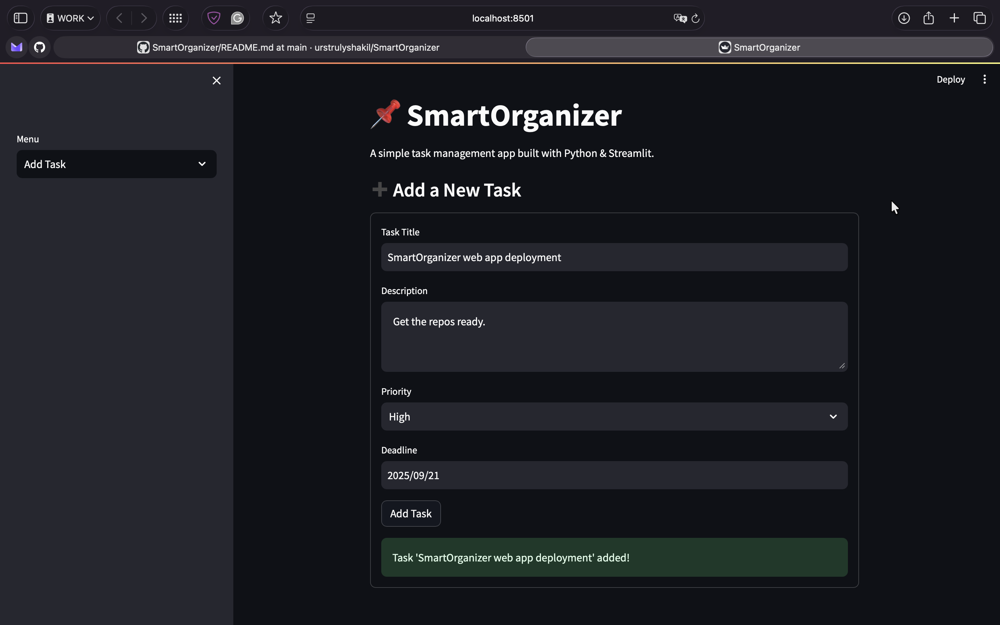
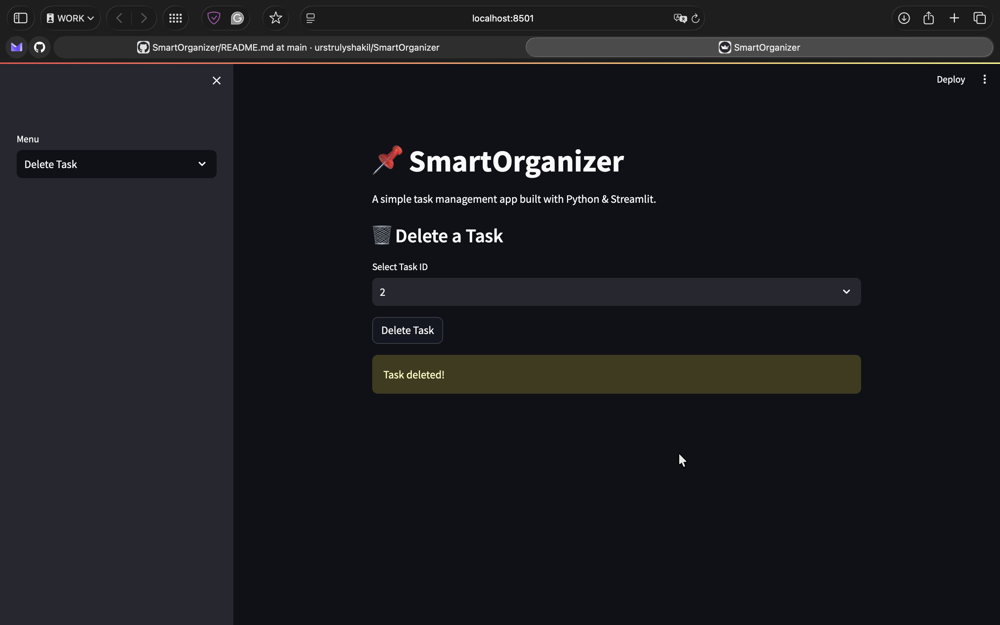
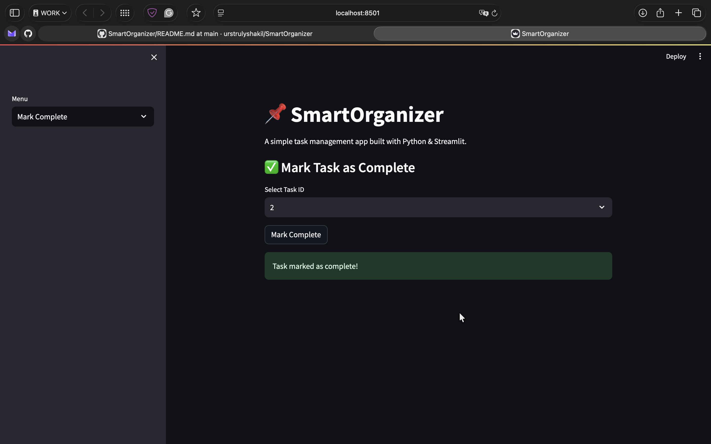
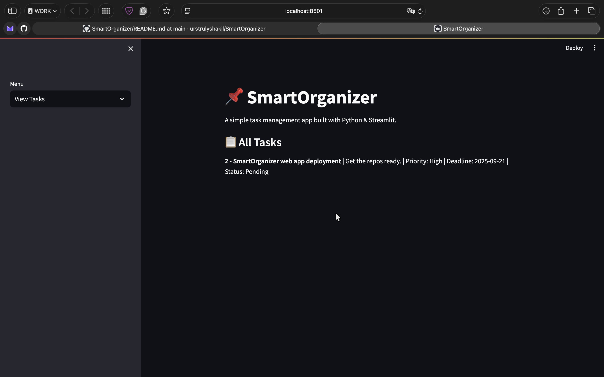

# 📌 SmartOrganizer

**SmartOrganizer** is a simple **task management app** built with **Python + Streamlit**.  
It helps you **add, view, complete, and delete tasks** in an easy-to-use interface.

---

## 🛠️ Tech Stack

- **Python** – Core programming language  
- **Streamlit** – Web app framework  
- **SQLite** – Database for persistence  
- **Git & GitHub** – Version control  

---

## 🚀 Features

- ➕ **Add tasks** with description, priority & deadline  
- 📋 **View all tasks** in one place  
- ✅ **Mark tasks as complete**  
- 🗑️ **Delete tasks** you no longer need  
- 🗄️ **Persistent storage** using SQLite  

---

## 📸 Screenshots

### ➕ Add Task


### 🗑️ Delete Task


### ✅ Mark Complete


### 📋 View Tasks


---

## ▶️ Run Locally

```bash
# Clone the repository
git clone https://github.com/urstrulyshakil/SmartOrganizer.git

# Navigate to the project folder
cd SmartOrganizer

# Install dependencies
pip install -r requirements.txt

# Run the app
streamlit run app.py
